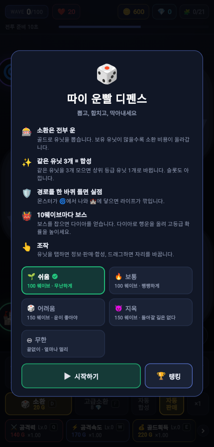
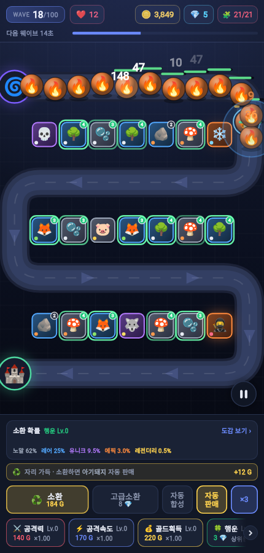
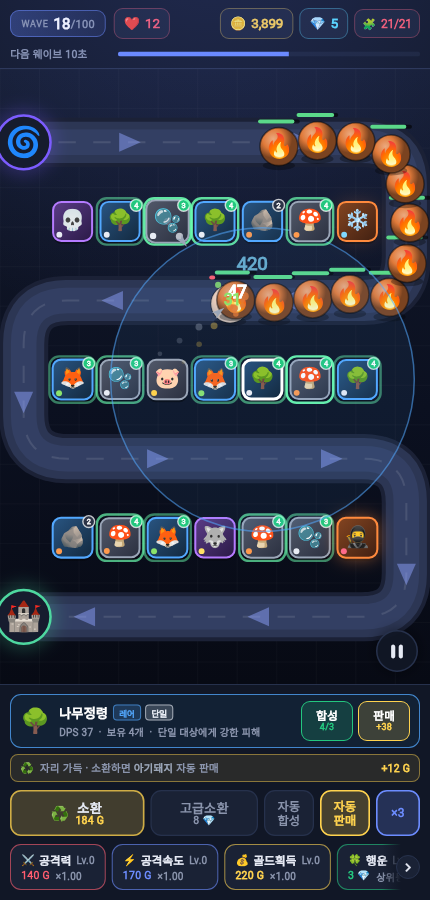
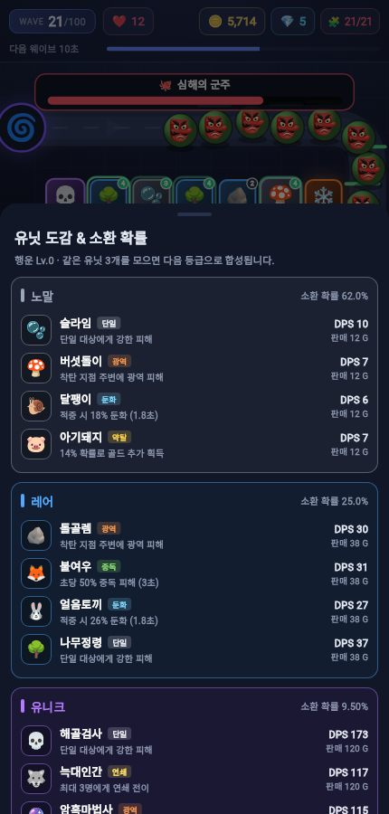
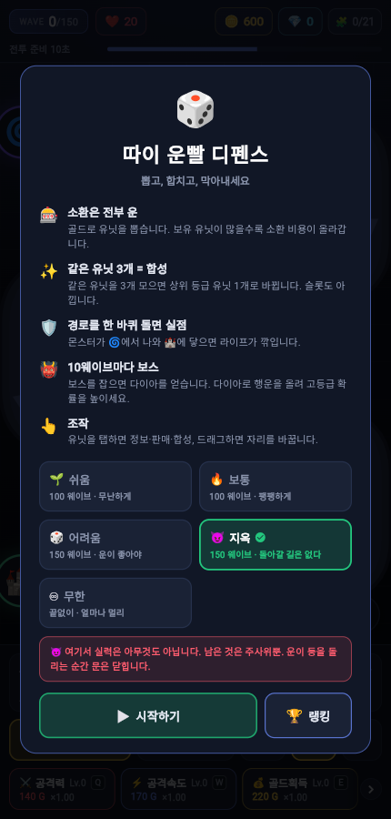
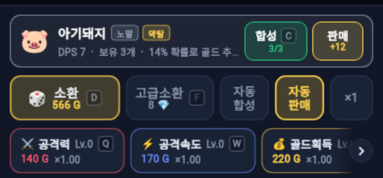

# 따이 운빨 디펜스 (Lucky Defense)

**뽑고, 합치고, 막아내세요.** 실력보다 운이 승부를 가르는 랜덤 디펜스 게임입니다.

### ▶ [웹에서 바로 플레이](https://ddai-min.github.io/ddai_lucky_defense/)

설치도 회원가입도 없습니다. 브라우저만 열면 폰·태블릿·데스크톱 어디서든 돌아갑니다.



## 어떤 게임인가

스타크래프트 유즈맵 「운빨 디펜스」 계열입니다.

몬스터가 🌀에서 나와 지그재그 길을 한 바퀴 돌아 🏰에 닿으면 라이프가 깎입니다.
막으려면 유닛을 세워야 하는데, **유닛은 골라서 살 수 없습니다.** 골드를 내고 뽑으면
무작위 등급이 나옵니다. 좋은 게 나오면 좋은 대로, 안 나오면 안 나오는 대로 막아야 합니다.

대신 길이 하나 있습니다 — **같은 유닛 3개를 모으면 한 등급 위로 합쳐집니다.**
그래서 한 판은 «얼마나 잘 뽑았나» 와 «뽑은 걸 어떻게 굴렸나» 로 갈립니다.

## 한 판은 이렇게 흘러갑니다

### ① 22초마다 웨이브가 온다. 그 사이에 뽑는다



위쪽 막대가 다음 웨이브까지 남은 시간입니다. 유닛은 **21칸**(한 줄 7칸 × 3줄)에만
세울 수 있고, 보유 유닛이 많을수록 소환 비용이 올라갑니다. 자리가 가득 차면 가장 낮은
등급이 자동으로 팔리고 그 자리에 새 유닛이 들어옵니다(조작 패널에서 꺼 둘 수 있습니다).

몬스터 머리 위 숫자는 들어간 피해입니다. 🏰까지 살아서 도착하면 라이프가 깎이고,
라이프가 0이 되면 끝입니다. 5·15·25… 웨이브는 **러시** 라서 체력이 낮은 대신
수가 많고 빠릅니다.

### ② 같은 유닛 3개를 합친다



유닛을 탭하면 사거리가 원으로 표시되고, 아래에 정보·합성·판매가 뜹니다.
`합성 4/3` 은 «3개 필요한데 4개 있다» 는 뜻입니다. 합치면 슬롯이 2칸 비고
전투력은 올라갑니다. 끌어다 놓으면 자리를 바꿀 수 있습니다.

### ③ 등급을 올린다



```
노말 → 레어 → 유니크 → 에픽 → 레전더리 → 신화 → 초월
```

**신화와 초월은 뽑기로 나오지 않습니다.** 오직 합성으로만 닿을 수 있습니다.
도감에서 지금 확률과 유닛별 성능을 볼 수 있고, 다이아로 **행운**을 올리면
상위 등급 확률이 높아집니다.

공격 방식도 유닛마다 다릅니다 — `단일` `광역` `둔화` `중독` `연쇄`
`처형`(즉사 확률) `약탈`(골드 추가 획득).

### ④ 강화하고, 끝까지 막아낸다

골드로는 공격력·공격속도·골드획득을, 다이아로는 행운과 라이프를 올립니다.
다이아는 10웨이브마다 나오는 **보스**를 잡으면 들어옵니다. 보스를 놓치면
라이프가 한 번에 5 깎이니 조심하세요.

다이아 8개로 쓰는 **고급소환**도 있습니다. 그냥 좋은 등급을 주는 게 아니라,
**합성까지 하나 남은 유닛이 있으면 그 유닛을 콕 집어 줍니다.** 무엇이 나올지
버튼에 미리 떠 있으니 보고 누르면 됩니다.

## 난이도 다섯 가지

| 모드 | 성격 | 라운드 | 도달률 | 깨는 판의 초월 |
| --- | --- | --- | --- | --- |
| 🌱 쉬움 | 무난하게 한 바퀴 | 100 | 99% | 4기 |
| 🔥 보통 | 처음부터 끝까지 팽팽하게 | 100 | 11% | 4기 |
| 🎲 어려움 | **운이 좋아야 깨진다** | **150** | 3% | 3기 |
| 😈 지옥 | **운이 아주 좋아야 깨진다** | **150** | **0.19%** | **6기** |
| ♾️ 무한 | 끝이 없다. 얼마나 멀리 가나 | ∞ | — | — |

맨 오른쪽 칸이 지옥의 정체입니다. 어려움은 초월 3기로 넘어가는데, 지옥은 6기
이상을 세워야 결승선에 닿습니다. 15% 도박으로 그만큼 모아야 하니 **500판에 한 번쯤**
깨집니다(라이프 20 시절에 잰 값입니다).

**지옥은 라이프가 1입니다.** 한 마리만 성에 닿아도 그대로 끝나고, 다이아로 살
수도 없습니다 — 조작 패널에 라이프 버튼 자체가 나오지 않습니다.



**어려움은 결승선도 멀고(150), 규칙도 하나 더 있습니다.** 신화 3개를 초월로 올리는
합성이 15% 도박입니다.
실패하면 2기가 사라지고, 성공하면 공격력이 4배인 초월이 나옵니다. 초월을 몇 기
세웠느냐로 판이 갈리기 때문에, 같은 실력으로 해도 결과가 판마다 크게 달라집니다.

**지옥은 어려움 곡선에 50웨이브부터 복리를 얹은 것입니다** — 웨이브마다 2% 씩
더 곱합니다. 50웨이브까지는 어려움과 한 숫자도 다르지 않고, 150웨이브에서는
7.2배가 됩니다(349,237 → 2,530,099).

초반을 올리면 초월을 보기도 전에 11웨이브에서 죽어 «아무도 못 깨는 모드» 가 되기
때문에, 조이는 자리를 일부러 뒤로 옮겼습니다.

**어려움과 지옥은 마지막 보스를 «잡아야» 클리어입니다.** 150웨이브 보스를 성까지
흘려보내면 라이프가 얼마나 남았든 실패로 끝납니다. 쉬움·보통에는 이 규칙이
없습니다 — 라이프만 남아 있으면 클리어입니다.

왜 이렇게 만들었는지는 [난이도와 밸런스](docs/balance.md) 에 적어 두었습니다.
한 줄로 줄이면 — **체력만 올리면 «운 좋으면 깬다» 가 아니라 «아무도 못 깬다» 가 되기
때문**입니다.

## 조작

| | |
| --- | --- |
| 유닛 탭 | 정보 · 판매 · 합성 · 합성 잠금 |
| 유닛 드래그 | 자리 교체 |
| 빈 곳 탭 | 선택 해제 |
| 우측 하단 ⏸ | 일시정지 — **계속** 과 **다시 도전**(1웨이브부터) 을 고릅니다 |
| ×1 / ×2 / ×3 | 배속 |

### 키보드 단축키 (웹 · 데스크톱)



마우스를 옮기지 않고 한 손으로 돌릴 수 있습니다. 버튼에 어떤 키인지 함께 떠 있습니다.

| 키 | 동작 |
| --- | --- |
| `D` | 소환 |
| `F` | 고급소환 |
| `C` | 고른 유닛 합성 |
| `V` | 고른 유닛 합성 잠금 |
| `Q` `W` `E` `R` `T` | 공격력 · 공격속도 · 골드획득 · 행운 · 라이프 |

`C` 와 `V` 는 **골라 둔 유닛에만** 듭니다. 아무것도 고르지 않았을 때 `C` 가
아무거나 합성해 버리면, 어려움에서는 누른 적 없는 초월 도박이 튀어나옵니다.

**합성 잠금(`V`)** 은 그 유닛 «종류» 를 자동 합성에서 빼 둡니다. 자동 합성을
켜 두면 재료로 쓰고 싶지 않은 유닛까지 올라가 버리는데, 잠가 두면 건너뜁니다.
**직접 누르는 합성은 잠겨 있어도 됩니다** — 자동으로 사라지는 것만 막습니다.
잠긴 유닛은 필드에서 왼쪽 위에 🔒 이 붙습니다.

키보드가 없는 기기에서는 표시가 나오지 않습니다. 인트로·일시정지·결과 화면에서는
버튼과 마찬가지로 키도 잠깁니다.

도달 웨이브 기준 **최고 기록**이 기기에 저장되어 HUD의 🏆, 인트로, 결과 화면에 뜹니다.

## 랭킹

**어려움·지옥·무한** 세 모드에는 다른 사람들과 도달 웨이브를 겨루는 랭킹이 있습니다.

소스를 받아 밸런스를 고친 빌드가 기록을 올리지 못하도록 **App Check** 을 씁니다.
등록 요청에 «이 도메인의 진짜 앱» 임을 증명하는 토큰이 실립니다 —
[랭킹 설정](docs/leaderboard.md) 에 켜는 순서와 한계를 적어 두었습니다.
판이 끝나면 결과 화면에서 이름을 적어 올리고, 인트로의 🏆 버튼으로 목록을 봅니다.
쉬움·보통에는 없습니다 — 쉬움은 거의 모두가 100웨이브를 채워 줄이 서지 않고,
보통은 «깼나 못 깼나» 라 순위가 의미가 없습니다.

랭킹은 Firebase 를 쓰며, **설정하지 않은 빌드에서는 기능이 통째로 숨습니다.**
켜는 방법은 [랭킹 설정](docs/leaderboard.md) 에 있습니다.

## 만든 방식

Flutter + [Flame](https://flame-engine.org) 게임 엔진으로 만들었습니다.
**이미지 에셋이 한 장도 없습니다** — 유닛도 몬스터도 전부 이모지이고, 배경·경로·
이펙트는 Canvas 드로잉입니다. 그래서 저장소가 가볍고, 유닛을 추가하려면 도감에
한 줄만 넣으면 됩니다.

난이도는 감으로 정하지 않았습니다. 게임과 같은 공식을 쓰는 [시뮬레이터](tool/balance_sim.dart)로
수백 판을 돌려 «몇 %가 깨는가» 를 재고 맞췄습니다.

## 더 읽을거리

- [난이도와 밸런스](docs/balance.md) — 수치를 어떻게 정했나, 시뮬레이터로 무엇을 알아냈나
- [코드 구조와 구현 노트](docs/architecture.md) — 폴더 구조, 실행 방법, 개발하며 밟은 지뢰들
- [웹 배포](docs/deploy.md) — GitHub Pages 자동 배포, 로딩 용량 이야기
- [랭킹 설정](docs/leaderboard.md) — Firebase 연결, 규칙, 위조에 대하여
